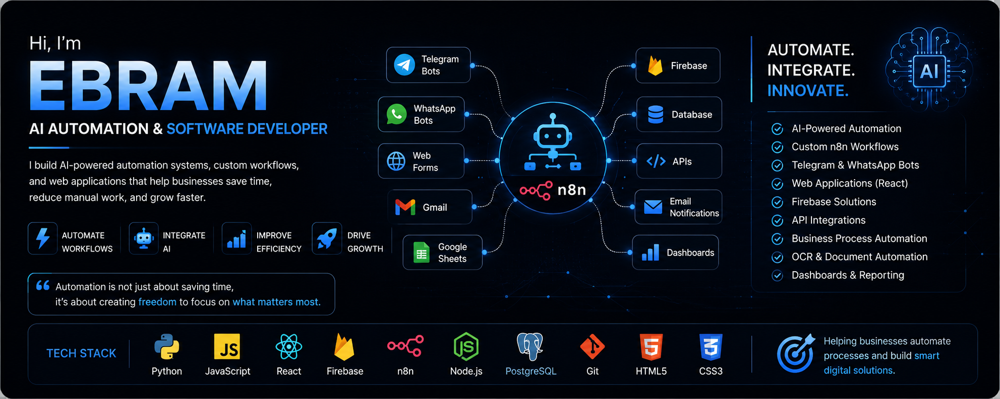
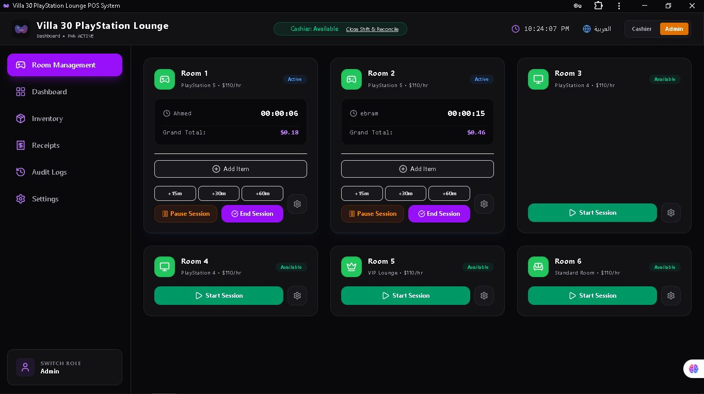
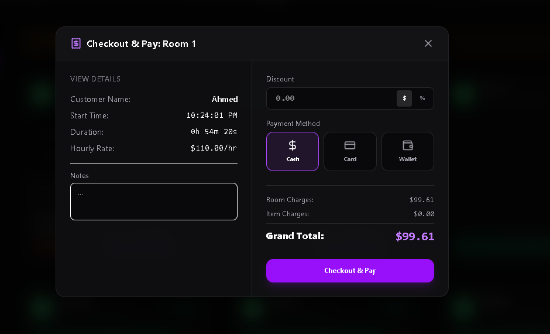
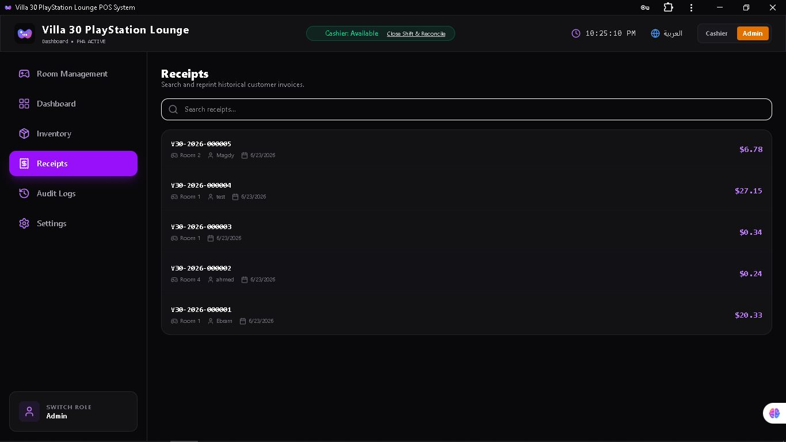
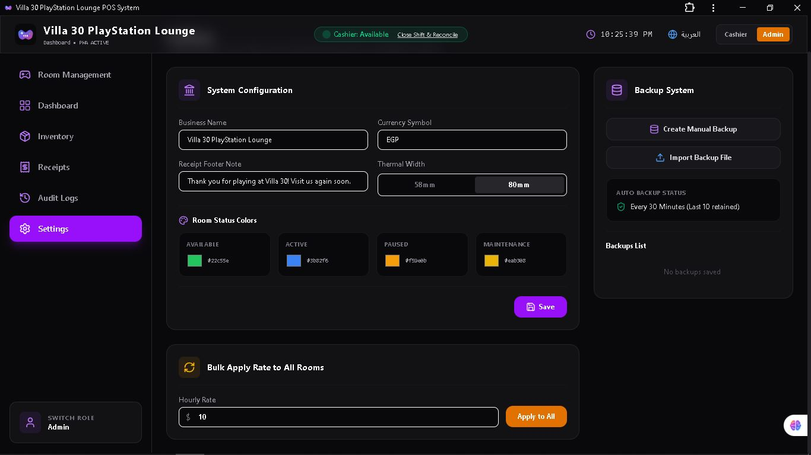
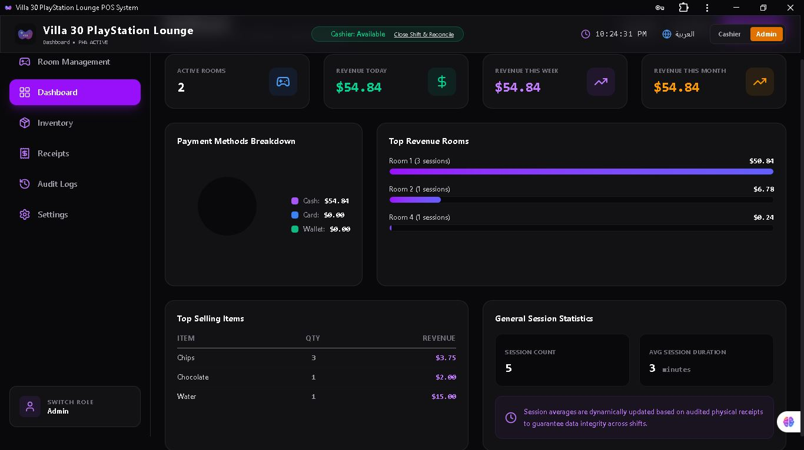
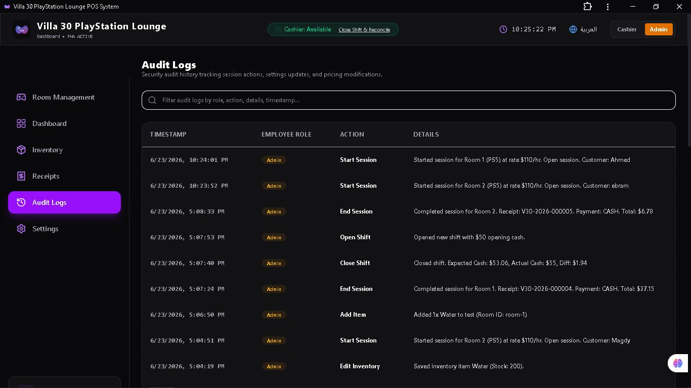

<p align="center">
  
</p>

[](https://react.dev/)
[](https://www.typescriptlang.org/)
[](https://vitejs.dev/)
[](https://tailwindcss.com/)
[](#)

# LoungeLink POS

Modern offline-first PlayStation Lounge Management System for room control, inventory tracking, billing, and analytics.

---

## 🚀 Overview

LoungeLink POS is a complete management system for gaming lounges and PlayStation centers.  
It works fully offline using IndexedDB and is designed for future cloud scaling.

---

## ✨ Key Features

### 🎮 Room Management
- Real-time session timers
- Start / pause / resume / end sessions
- Room pricing control
- Maintenance mode
- Live session tracking

### 📦 Inventory System
- Stock tracking
- Categories management
- Low stock alerts
- Quick access items

### 💳 Billing & Checkout
- Automatic session calculation
- Item billing system
- Discounts support
- Receipt generation
- Thermal printer support
- Receipt history

### 📊 Analytics
- Revenue tracking
- Session statistics
- Payment breakdowns
- Business insights

### 🌐 Multi-Language
- English / Arabic
- RTL support

### 💾 Offline First
- IndexedDB storage
- Fully offline operation
- Auto data recovery
- Backup & restore support

---

## 🛠 Tech Stack

- React
- TypeScript
- Vite
- TailwindCSS
- IndexedDB

---

## 📸 Screenshots

### 🏠 Admin Dashboard


### 👨‍💼 Cashier Dashboard


### 📦 Inventory Management


### 💳 Checkout System


### 🧾 Receipts


### ⚙️ Settings


### 📊 Statistics


### 🗂 Audit Logs


---

## ⚙️ Installation

```bash
npm install
npm run dev
