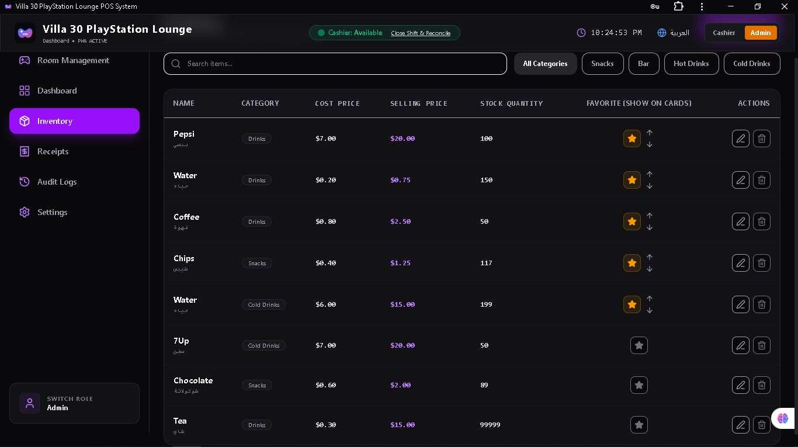

# LoungeLink POS

A modern offline-first PlayStation Lounge Management System built with React, TypeScript, TailwindCSS, and IndexedDB.

## Overview

LoungeLink POS is designed for PlayStation lounges and gaming centers that need a fast and reliable way to manage room sessions, inventory, receipts, and reports.

The system works completely offline and is designed for future migration to cloud platforms such as Firebase.

## Features

### Room Management

* Real-time room timers
* Start, pause, resume and end sessions
* Room-specific hourly pricing
* Maintenance mode
* Custom room names

### Inventory Management

* Drinks, snacks and accessories
* Stock tracking
* Low stock alerts
* Favorite items for quick access

### Checkout & Receipts

* Automatic time calculation
* Item billing
* Discounts
* Thermal receipt support
* Receipt history

### Reports

* Daily revenue
* Session statistics
* Payment method breakdown
* Export functionality

### Multi-language Support

* English
* Arabic
* RTL Support

### Offline First

* IndexedDB Storage
* Automatic persistence
* Backup and restore support

## Technology Stack

* React
* TypeScript
* Vite
* TailwindCSS
* IndexedDB

## Future Roadmap

* Firebase Synchronization
* Multi-device Support
* Cloud Backups
* User Authentication
* WhatsApp Notifications

## Screenshots

## Screenshots

### Dashboard


### Inventory



### Checkout


### Reports


### Settings


## Installation

```bash
npm install
npm run dev
```

## License

Portfolio Project by Ebram Sherif
